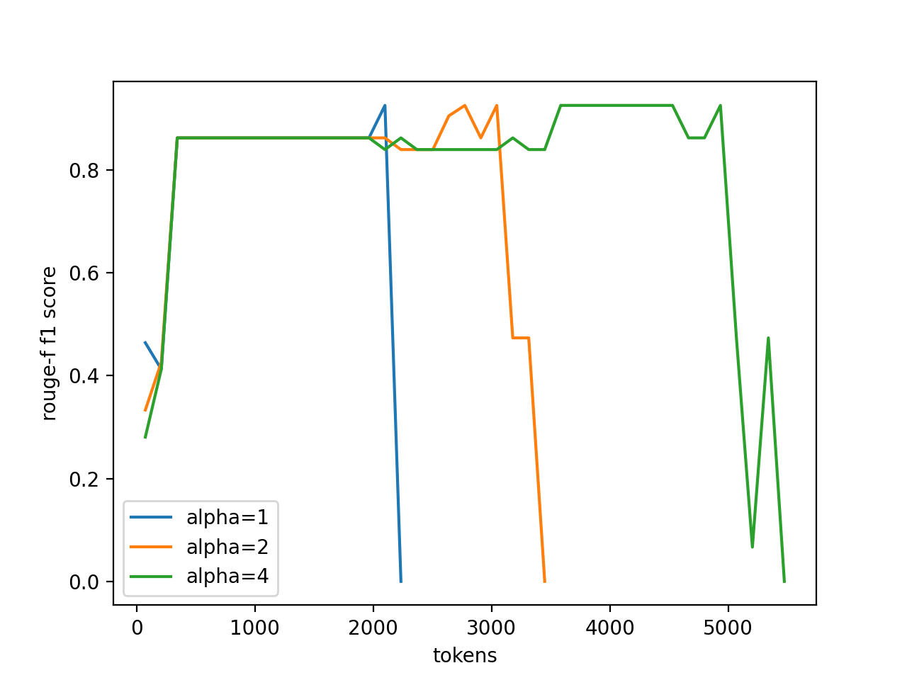

# NTK Aware Scaled RoPE Emperiment

Experiment result:

# References

1. [Transformer升级之路：10、RoPE是一种β进制编码](https://kexue.fm/archives/9675)
2. [NTK-Aware Scaled RoPE allows LLaMA models to have extended (8k+) context size without any fine-tuning and minimal perplexity degradation.](https://www.reddit.com/r/LocalLLaMA/comments/14lz7j5/ntkaware_scaled_rope_allows_llama_models_to_have/)